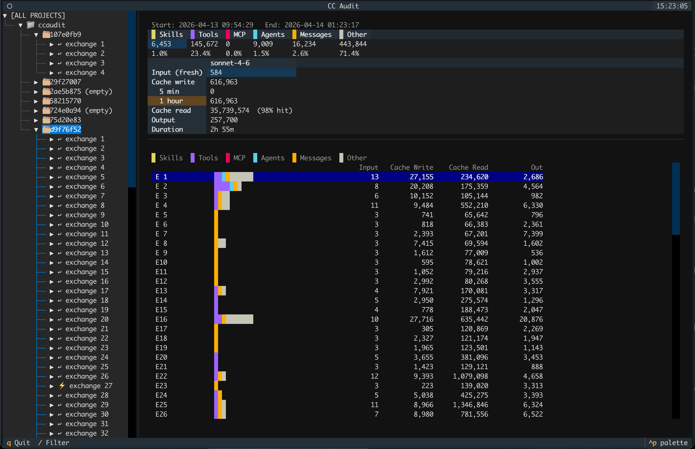

# ccaudit — Coding Agent Token Usage Explorer

ccaudit is a terminal UI for exploring how your coding agents spend their token budget. It reads the JSONL session logs written by **Claude Code** (`~/.claude/projects/`) and **OpenAI Codex CLI** (`~/.codex/sessions/`), and breaks down token usage by session, exchange, and content category.

Both harnesses are merged by working directory: a project node is a code directory, and the sessions under it come from whichever agents you ran there. Each exchange records its own model, so a directory you have worked in with both tools shows `claude-opus-5` and `gpt-5.6-sol` sessions side by side.



---

## Contents

- [Getting Started](#getting-started)
- [Session History Retention](#session-history-retention)
- [Live Reload](#live-reload)
- [How Sessions and Exchanges Are Stored](#how-sessions-and-exchanges-are-stored)
- [What Is an Exchange?](#what-is-an-exchange)
- [Top-Level Message Envelope](#top-level-message-envelope)
- [User Message](#user-message)
- [Assistant Message](#assistant-message)
- [System Message — Compact Boundary](#system-message--compact-boundary)
- [Codex Rollout Format](#codex-rollout-format)
- [Token Categories](#token-categories)
- [Parsed Data Model](#parsed-data-model)
  - [Model Attribution](#model-attribution)
- [Schema Sources](#schema-sources)

---

## Getting Started 

### With uv (recommended)

```bash
uv run main.py
```

uv reads `requirements.txt` and manages the environment automatically.

### With venv

```bash
# Create and activate a virtual environment
python3 -m venv .venv
source .venv/bin/activate

# Install dependencies
pip install -r requirements.txt

# Run (reads all projects by default)
python main.py
```

### Command-Line Flags

| Flag | Default | Meaning |
|---|---|---|
| `-a`, `--all` | Yes | Read all projects from every enabled source |
| `-d PATH`, `--dir PATH` | — | Show only the project that corresponds to the code directory at `PATH`. Looks up the matching project by slug; does not read JSONL files from `PATH` itself. |
| `-s`, `--source {claude,codex,all}` | `all` | Which harness logs to read |

`-a` and `-d` are mutually exclusive. If neither is given, `--all` is the default. `-s` composes with both.

**Example — view only the current project:**
```bash
python main.py -d .
python main.py -d ~/code/myproject
```

**Example — audit one harness at a time:**
```bash
python main.py -s codex             # Codex sessions only
python main.py -s claude -d .       # Claude sessions for the current directory
```


---

## Session History Retention

**The two harnesses have opposite retention behaviour, and it materially affects what ccaudit can show you.**

| | Claude Code | Codex CLI |
|---|---|---|
| Automatic cleanup | Yes — 30 days by default | **None** |
| Setting | `cleanupPeriodDays` in `~/.claude/settings.json` | No equivalent |
| When it runs | On launch, against each transcript's last-modified time | Never |
| Manual deletion | Delete files under `~/.claude/projects/` | `codex delete` / `codex archive` |

### Claude Code deletes old transcripts silently

Claude Code removes session transcripts whose last-modified time is older than `cleanupPeriodDays`. The default is **30 days**, applied whenever the setting is absent — which means the default is easy to be subject to without ever having seen it. To keep more history:

```json
// ~/.claude/settings.json
{ "cleanupPeriodDays": 90 }
```

There is no "never" value, but a large number works in practice. **Anything already past the cutoff is gone and cannot be recovered** — the token usage in those sessions is unrecoverable, since the JSONL is the only record ccaudit reads.

### Codex keeps everything, forever

Codex CLI has no retention policy, no cleanup setting, and no expiry. Every session since installation is still on disk. Deletion is manual only:

```bash
codex delete <id|name>      # permanently delete a saved session
codex archive <id|name>     # archive instead (reversible via codex unarchive)
```

This has a practical cost. Rollout files store a `reasoning` item with an opaque `encrypted_content` blob on every turn, so a single long session can reach **10–15 MB**, and the directory grows without bound.

### What this means for cross-harness totals

Because Claude's history is a rolling 30-day window while Codex's accumulates indefinitely, **merged project totals are not apples-to-apples** — you are comparing one month of Claude against your entire Codex history, and the skew widens over time. Use `--source` to compare a single harness against itself, and treat combined totals as indicative rather than exact.


---

## Live Reload

ccaudit watches the log directories while it runs (macOS kqueue) and updates the tree and detail pane in place as sessions grow — no restart needed. This works for both harnesses.

Claude Code is straightforward: each project directory is watched for new session files, and open sessions are watched for appends.

Codex needs more care, because rollouts are filed by date rather than by project:

- **Routing.** One day directory holds rollouts for many different working directories, so a newly appeared rollout is routed by reading its `session_meta` cwd and matching the slug — not by which directory it landed in.
- **Day rollover.** The sessions root, year, and month directories are watched so that a new day directory appearing at midnight is picked up. Only the two newest day directories are watched for new files; older ones can no longer gain rollouts, and watching them would spend a file descriptor each for nothing.
- **Mid-write files.** A rollout exists on disk before its first line is flushed, so a file whose cwd cannot yet be read is retried on its first write rather than dropped.
- **Running exchanges.** A Codex exchange accumulates `token_count` deltas for as long as it runs, so the trailing exchange is refreshed in place rather than only new exchanges being appended.

One limitation: a Codex rollout for a directory that had no sessions when ccaudit started is ignored rather than creating a new project node at runtime. Restart to pick it up.


---

## How Sessions and Exchanges Are Stored

Both harnesses record every API call to disk as a JSONL file, one JSON object per line. Blank and malformed lines are skipped. The two layouts differ:

### Claude Code Storage Layout

```
~/.claude/projects/
  <project-slug>/
    <session-id>.jsonl
    <session-id>.jsonl
    ...
```

- **Project slug**: a filesystem-safe encoding of the working directory path. Forward slashes are replaced with hyphens, with a leading hyphen. Example: `/Users/alan/code/myproject` → `-Users-alan-code-myproject`.
- **Session ID**: a UUID identifying one continuous Claude Code session. The JSONL filename stem is the session ID.

### Codex Storage Layout

```
~/.codex/sessions/
  <YYYY>/<MM>/<DD>/
    rollout-<ISO-timestamp>-<thread-id>.jsonl
    ...
```

Codex organises by **date, not by project**. The working directory is recorded inside the file, on the `session_meta` line (`payload.cwd`). ccaudit reads only the first line of each rollout to discover that directory, converts it to the same slug format Claude Code uses, and merges the session into the matching project node — so one project node can contain sessions from both harnesses.


---

## What Is an Exchange?

An **exchange** (this project's term) is one complete human-to-assistant interaction: from a human-typed message through all intermediate tool round-trips, up to but not including the next human-typed message.

The Anthropic API uses "turn" to mean a single message from one role (one `user` or one `assistant` message). An exchange in ccaudit spans multiple API turns whenever Claude calls tools.

A single exchange can contain several API message pairs:

```
user_A   — human message                ← exchange 1 starts here
asst_A   — tool_use (e.g. Read file)
user_B   — tool_result
asst_B   — tool_use (e.g. Write file)
user_C   — tool_result
asst_C   — final text response          ← exchange 1 ends here
user_D   — next human message           ← exchange 2 starts here
asst_D   — final text response          ← exchange 2 ends here
```

Exchange boundaries are detected by **content inspection**, not by pointer following:

- A user message opens a new exchange if it contains at least one text block that is not injected context (skills or system reminders).
- A user message is an **intermediate tool-result message** if every block has `type: tool_result`. These belong to the current open exchange and do not start a new one.

Token usage for an exchange is the **sum across all assistant messages** in that exchange, not just the final one.


---

## Top-Level Message Envelope
  
Every line in the JSONL file is a JSON object with this shape:

```json
{
  "type": "user" | "assistant" | "system",
  "message": { ... },
  "timestamp": "2026-01-15T10:30:00.000Z",
  "uuid": "a63bf130-920c-46be-a7c5-a9dc2d435487",
  "parentUuid": "d9f76f52-366c-4d12-932d-7afdceaafe44",
  "requestId": "req_01XyzAbc...",
  "subtype": "compact_boundary",
  "content": "...",
  "compactMetadata": { ... }
}
```

| Field | Present when | Meaning |
|---|---|---|
| `type` | Always | `"user"`, `"assistant"`, or `"system"`. Determines the shape of the rest of the object. |
| `message` | `type` is `"user"` or `"assistant"` | The actual API-level message object (see below). |
| `timestamp` | Always | ISO-8601 datetime string indicating when this message was written. Timezone is typically UTC (`Z`). |
| `uuid` | Always | Unique identifier for this message record. |
| `parentUuid` | Always (except first message) | The `uuid` of the immediately preceding message. Forms a linked list that can reconstruct conversation order. `null` or absent on the first message in a session. Does **not** encode exchange boundaries — distinguishing human messages from intermediate tool-result messages requires inspecting content, not following the chain. |
| `requestId` | `type` is `"assistant"` | The Anthropic API request ID for this assistant message. Useful for correlating with API logs or billing. |
| `subtype` | `type` is `"system"` | Currently only `"compact_boundary"` is observed. |
| `content` | `type` is `"system"` | The compacted context summary text (only present on compact boundary events). |
| `compactMetadata` | `type` is `"system"` | Metadata about the compaction event (see below). |


---

## User Message

When `type == "user"`, the `message` object is:

```json
{
  "role": "user",
  "content": "string" | [ ...content blocks... ]
}
```

| Field | Meaning |
|---|---|
| `role` | Always `"user"`. |
| `content` | The message content. Can be a plain string (rare) or an array of content blocks (typical). When Claude Code is active, the content array is structured: injected context (skills, system reminders, tool results) appears first, followed by the human-typed message as the last text block. |

### Content Block Types (User)

**Text block** — either injected context or the human's actual message:
```json
{ "type": "text", "text": "..." }
```

**Tool result block** — the output of a tool that the assistant called:
```json
{
  "type": "tool_result",
  "tool_use_id": "toolu_...",
  "content": "string" | [ { "type": "text", "text": "..." }, ... ]
}
```

The `content` inside a tool result can itself be a string or a list of text blocks.

### User Message Content Order

Claude Code builds user messages in this order (concatenated into the content array):

1. **Skills** — loaded skill files, each preceded by `Base directory: /path/to/skills/...`
2. **System reminders** — `<system-reminder>...</system-reminder>` blocks injected by hooks, MCP servers, or Claude Code internals
3. **Tool results** — `tool_result` blocks from the previous assistant message's tool calls
4. **Human text** — the actual message the user typed (always the last plain text block)

Extracting the human's text means walking backwards through the content array to find the last text block that is not injected context.


---

## Assistant Message

When `type == "assistant"`, the `message` object is:

```json
{
  "role": "assistant",
  "model": "claude-sonnet-4-6",
  "content": "string" | [ ...content blocks... ],
  "usage": {
    "input_tokens": 1234,
    "cache_read_input_tokens": 5678,
    "cache_creation_input_tokens": 910,
    "cache_creation": {
      "ephemeral_5m_input_tokens": 500,
      "ephemeral_1h_input_tokens": 410
    },
    "output_tokens": 456
  }
}
```

| Field | Meaning |
|---|---|
| `role` | Always `"assistant"`. |
| `model` | The model that produced this response (e.g. `"claude-sonnet-4-6"`). May be `"<synthetic>"` for internally-generated responses that did not invoke a real LLM. |
| `content` | The assistant's response: a plain string (rare) or a list of text and tool-use blocks. |
| `usage` | Token accounting for this API call. Messages without `usage` are streaming artifacts and are skipped by the loader. |

### Usage Fields

| Field | Meaning |
|---|---|
| `input_tokens` | **Fresh input tokens** — tokens that were not served from cache. Billed at the standard input rate. |
| `cache_read_input_tokens` | **Cache hit tokens** — prompt tokens served from the prompt cache. Billed at ~10% of the fresh input rate. High values mean Claude reused cached context from a prior exchange. |
| `cache_creation_input_tokens` | **Cache write tokens** — tokens added to the prompt cache this call. Billed at ~125% of the fresh input rate; they will be cheap to reuse in future exchanges. |
| `cache_creation.ephemeral_5m_input_tokens` | Subset of cache writes that use a 5-minute TTL cache slot. |
| `cache_creation.ephemeral_1h_input_tokens` | Subset of cache writes that use a 1-hour TTL cache slot. |
| `output_tokens` | **Output tokens** — tokens in Claude's response. Billed at the output rate. |

**Total prompt size** for an exchange ≈ `input_tokens + cache_read_input_tokens + cache_creation_input_tokens` (summed across all assistant messages in the exchange). Only `input_tokens + cache_creation_input_tokens` are freshly processed; cache hits are served without reprocessing.

### Content Block Types (Assistant)

**Text block** — Claude's written response:
```json
{ "type": "text", "text": "..." }
```

**Tool use block** — a tool call Claude is making:
```json
{
  "type": "tool_use",
  "id": "toolu_01abc...",
  "name": "Read",
  "input": { "file_path": "/path/to/file" }
}
```

| Field | Meaning |
|---|---|
| `id` | Unique identifier for this tool call. Matched against `tool_result.tool_use_id` in the next user message. |
| `name` | The tool name (e.g. `"Read"`, `"Write"`, `"Bash"`, `"Agent"`, `"Grep"`, `"Glob"`, or `"mcp__<server>__<tool>"` for MCP tools). |
| `input` | Tool-specific parameters as a dict. |


---

## System Message — Compact Boundary

When `type == "system"` and `subtype == "compact_boundary"`, Claude Code has compressed the conversation history:

```json
{
  "type": "system",
  "subtype": "compact_boundary",
  "timestamp": "2026-01-15T10:45:00.000Z",
  "content": "Summary of prior conversation...",
  "compactMetadata": {
    "trigger": "auto" | "manual",
    "preTokens": 95000
  }
}
```

| Field | Meaning |
|---|---|
| `content` | The compressed summary that replaces the prior conversation history. |
| `compactMetadata.trigger` | `"auto"` if triggered automatically (context approaching limit); `"manual"` if the user ran `/compact`. |
| `compactMetadata.preTokens` | Token count immediately before compaction. |

The first exchange after a compact boundary is tagged `after_compact = true` in the parsed model. Its `cache_read_input_tokens` reflects the compressed context being cached, not the original system prompt. In the TUI, these exchanges are marked with a ⚡ prefix.


---

## Codex Rollout Format

Codex rollout files use a different envelope from Claude Code. Every line is `{"timestamp", "type", "payload"}`, where `type` selects the payload shape.

| Line | Meaning |
|---|---|
| `session_meta` | First line. `payload.id` (unique per file), `payload.session_id` (thread **group** id), `payload.cwd`, `payload.thread_source`, `payload.source` |
| `turn_context` | Per turn. `payload.model` (e.g. `gpt-5.6-sol`), `payload.cwd`, `payload.turn_id` |
| `event_msg` / `user_message` | The human prompt. **Exchange boundary.** |
| `event_msg` / `agent_message` | Assistant visible text |
| `event_msg` / `token_count` | `payload.info.total_token_usage` (cumulative) and `last_token_usage` (per request) |
| `event_msg` / `context_compacted`, `compacted` | Compaction boundary |
| `response_item` / `message` | `role` ∈ `user` / `assistant` / `developer` |
| `response_item` / `reasoning` | `summary[]` plus an opaque `encrypted_content` blob |
| `response_item` / `custom_tool_call` (+ `_output`) | Tool call — `name`, `call_id`, `input` string |
| `response_item` / `function_call` (+ `_output`) | Tool call — `name`, `arguments` JSON string |

### Token Accounting Differences

Two properties of the Codex format differ from Anthropic's and are easy to get wrong:

**1. `input_tokens` includes cached tokens.** Anthropic reports `input_tokens` and `cache_read_input_tokens` as disjoint quantities; Codex's `input_tokens` is the total, with `cached_input_tokens` a subset of it. Fresh input is therefore `input_tokens − cached_input_tokens`.

**2. Cumulative snapshots must be differenced, not summed.** `token_count` events are sometimes emitted more than once with an identical `total_token_usage` snapshot. Naively summing `last_token_usage` over a session overcounts — on one real session by 0.2% (30,741,453 against an authoritative total of 30,674,711). ccaudit instead derives each request's usage from the **delta between consecutive cumulative `total_token_usage` snapshots**, which is exact by construction; a zero delta identifies a duplicate event and is discarded.

Each rollout file carries its own independent cumulative counter starting near zero, so files never double-count each other.

Field mapping onto ccaudit's model:

| `ExchangeStats` field | Codex source |
|---|---|
| `input_tokens` | Σ delta(`input_tokens`) − delta(`cached_input_tokens`) |
| `cache_read_tokens` | Σ delta(`cached_input_tokens`) |
| `cache_create_tokens` | Σ delta(`cache_write_input_tokens`) |
| `output_tokens` | Σ delta(`output_tokens`) — includes reasoning |
| `reasoning_output_tokens` | Σ delta(`reasoning_output_tokens`) |
| `cache_create_5m_tokens`, `cache_create_1h_tokens` | Always 0 — no Codex equivalent |
| `model` | Nearest preceding `turn_context.payload.model` |

### Subagent Threads

**`payload.session_id` is not unique.** It identifies a thread *group*: a parent session and the subagents it spawns all share one `session_id`, each writing its own rollout file. `payload.id` is the per-file identifier, and it is the one ccaudit uses as `session_id`.

The `session_meta` line distinguishes them:

- `thread_source: "user"` — a session you started; `source` is `"cli"`
- `thread_source: "subagent"` — spawned automatically; `source` is `{"subagent": {"other": "guardian"}}` or `{"subagent": "review"}`

Subagent sessions are displayed with their name appended (`01a0614d ⤷guardian`) and keep their own full category breakdown rather than being folded into the parent. This matters because subagent spend is not marginal: **`guardian`** — the reviewer Codex invokes to assess each planned action for risk — re-reads the transcript on every invocation to emit a small verdict, and can account for a substantial share of fresh input tokens while producing almost no output.


---

## Token Categories

ccaudit classifies each exchange's fresh token budget across seven categories by inspecting content blocks structurally, then attributing tokens proportionally to character counts. Both harnesses map onto the same categories.

### Category Definitions

| Category | What it represents | Identified by |
|---|---|---|
| **Skills** | Skill files injected into the prompt by the Superpowers plugin or similar systems | `text` blocks (user) whose first line starts with `Base directory: .../skills/` |
| **Tools** | Built-in Claude Code tool calls and their results — file reads, shell commands, searches, web fetches, etc. | `tool_use` blocks (assistant) for non-MCP, non-Agent tools; matching `tool_result` blocks (user) |
| **MCP** | MCP (Model Context Protocol) server tool calls and their results | `tool_use` blocks (assistant) whose name starts with `mcp__`; matching `tool_result` blocks (user) |
| **Agents** | Subagent dispatch — calls to the `Agent` tool that spin up a subprocess | `tool_use` blocks (assistant) with `name == "Agent"` |
| **Messages** | The actual human-to-assistant conversation: what you typed and what the model wrote back | The last `text` block in user content (the human's message); all `text` blocks in assistant content |
| **Reasoning** | Extended thinking / reasoning content occupying context | `thinking` and `redacted_thinking` blocks (Claude); `reasoning` items — `summary` plus `encrypted_content` — (Codex) |
| **Other** | Invisible overhead not present in the JSONL — see below | Fresh tokens remaining after attributing all visible characters |

### Codex Category Mapping

Codex has no equivalent of Claude Code's skill injection, so **Skills is always 0** for Codex sessions. Otherwise:

| Category | Codex source |
|---|---|
| **Messages** | `user_message`, `agent_message`, and `message` items with role `user` or `assistant` |
| **Reasoning** | `reasoning` items (`summary` + `encrypted_content` length) |
| **Tools** | `custom_tool_call` / `function_call` and their `_output` counterparts — observed names include `exec`, `apply_patch`, `update_plan`, `view_image` |
| **MCP** | Tool calls whose name matches the MCP naming convention |
| **Agents** | Sub-agent spawn tools |
| **Other** | `message` items with role `developer` (permissions, base instructions), plus invisible overhead |

Note that Codex subagent work does **not** appear under Agents — subagents write their own rollout files and surface as separate sessions (see [Subagent Threads](#subagent-threads)).

### What "Other" Represents

**Other is typically the largest category and reflects content that is genuinely invisible to ccaudit.** The JSONL does not capture the full prompt that Claude receives — several things are injected server-side or reconstructed by Claude Code without being logged:

- **System prompt** — Anthropic's base system prompt is sent with every request but never written to the JSONL
- **CLAUDE.md** — project and user instructions are injected but not logged as separate blocks
- **Memory files** — auto-memory content loaded at session start
- **Cache refresh overhead** — when a cache miss forces Claude to re-process the entire context window, `cache_creation_input_tokens` can spike to tens of thousands of tokens while the visible user message is only a few hundred characters; all of that invisible re-processing goes to Other
- **Other injected context** — tool descriptions, project state, and other content that Claude Code or the API layer inserts without logging

A large Other on a given exchange usually means either (a) the system prompt and CLAUDE.md are dominating that exchange's context, or (b) a cache refresh occurred.

### How Attribution Works

The fresh token budget for an exchange (`input_tokens + cache_creation_input_tokens`, summed across all assistant messages in the exchange) is split into two parts:

1. **Visible token estimate** — an upper bound on how many tokens the logged content could plausibly represent, computed as `total_visible_chars / 4`. The constant 4 is a standard English/code heuristic (roughly 3.5–4 characters per token); it errs toward attributing more to Other.
2. **Invisible overhead** — `fresh_tokens − visible_token_estimate`, floored at zero. Assigned entirely to **Other**.

The visible categories (Skills, Tools, MCP, Agents, Messages) share only the visible token estimate, divided in proportion to their character counts.

This means Other will almost always be substantial — reflecting the real cost of the system prompt and injected context — rather than being a rounding remainder. It is an approximation; the true split cannot be recovered without access to the full reconstructed prompt.

**MCP tool results** are routed to the MCP category (not Tools) by looking up the `tool_use_id` in the preceding assistant message to recover the original tool name.


---

## Parsed Data Model

The loader produces these Python dataclasses (defined in `parser/models.py`):

### ExchangeStats

One complete human-to-assistant exchange, including all intermediate tool round-trips.

| Field | Type | Source |
|---|---|---|
| `exchange_number` | `int` | 1-based counter within the session |
| `timestamp` | `str` | `timestamp` of the final assistant message in the exchange |
| `input_tokens` | `int` | Sum of `usage.input_tokens` across all assistant messages in the exchange |
| `cache_read_tokens` | `int` | Sum of `usage.cache_read_input_tokens` |
| `cache_create_tokens` | `int` | Sum of `usage.cache_creation_input_tokens` |
| `cache_create_5m_tokens` | `int` | Sum of `usage.cache_creation.ephemeral_5m_input_tokens` |
| `cache_create_1h_tokens` | `int` | Sum of `usage.cache_creation.ephemeral_1h_input_tokens` |
| `output_tokens` | `int` | Sum of `usage.output_tokens` |
| `reasoning_output_tokens` | `int` | Reasoning tokens within `output_tokens`. Codex only; always 0 for Claude, which does not report it separately |
| `category_breakdown` | `CategoryBreakdown` | Per-category token estimates |
| `after_compact` | `bool` | `True` if the human message immediately followed a compact boundary |
| `user_text` | `str` | Last text block of user content that isn't injected context (≤800 chars) |
| `assistant_text` | `str` | Text blocks from the final assistant message joined (≤800 chars) |
| `files_read` | `list[str]` | Paths from `Read` calls; `Glob:pattern` for Glob; `Grep:'pattern' in path` for Grep |
| `tool_calls` | `list[tuple[str, dict]]` | `(tool_name, input_dict)` for every `tool_use` block across all assistant messages |
| `model` | `str` | Model name for this exchange (see [Model Attribution](#model-attribution)); empty string if unknown |
| `raw_user` | `dict` | Full JSONL envelope of the opening human user message |
| `raw_assistants` | `list[dict]` | Full JSONL envelopes of all assistant messages in the exchange (intermediates + final) |
| `jsonl_path` | `str` | Absolute path to the source JSONL file |

#### Model Attribution

The `model` field is populated from `message.model` on the first assistant message in the exchange that carries a non-synthetic model value. A few caveats:

- **One model per exchange** — ccaudit assumes the whole exchange ran on a single model. In practice Claude Code does not switch models mid-exchange, so the first assistant response's model is used for the entire exchange.
- **`<synthetic>` is ignored** — some assistant messages carry `message.model = "<synthetic>"` to indicate the response was produced internally without a real LLM call (e.g. canned responses or token usage hitting limit). These values are skipped; the loader continues to the next assistant message in the exchange looking for a real model name.
- If no real model is found, `model` is left as an empty string and the exchange is excluded from per-model aggregations in the TUI.

### SessionStats

One session (one JSONL file), from either harness.

| Field | Meaning |
|---|---|
| `session_id` | Claude: UUID from the filename stem. Codex: `session_meta.payload.id` — **not** `session_id`, which is shared across a thread group |
| `display_name` | First 8 characters of the session ID, with `⤷<name>` appended for Codex subagent threads |
| `first_timestamp` | Timestamp of the first message in the file |
| `exchanges` | Ordered list of `ExchangeStats` |

### ProjectStats

One code directory, holding sessions from every harness used in it.

| Field | Meaning |
|---|---|
| `project_slug` | Slug form of the directory path (e.g. `-Users-alan-code-myproject`). The merge key across both harnesses |
| `display_name` | Human-readable name: the portion of the slug after the 3rd hyphen-separated path component |
| `sessions` | List of `SessionStats`, interleaved from both sources and sorted by recency in the tree |
| `claude_dir` | Absolute path to the `~/.claude/projects/<slug>/` directory, or `None` for a Codex-only project |
| `codex_files` | Absolute paths to the Codex rollout files for this directory; empty for a Claude-only project |
| `loaded` | `False` until `load_project()` is called (lazy loading) |
| `load_error` | Set to an error string if loading fails; `None` otherwise. Per-file failures are isolated, so one corrupt rollout does not hide a project's other sessions |


---

## Schema Sources

The fields documented here come from two distinct sources:

**Anthropic Messages API** — officially documented at [docs.anthropic.com](https://docs.anthropic.com/en/api/messages):
- `usage.input_tokens`, `cache_read_input_tokens`, `cache_creation_input_tokens`, `output_tokens`
- `usage.cache_creation.ephemeral_5m_input_tokens`, `ephemeral_1h_input_tokens` (prompt caching with TTL)
- `role`, `content`, and all content block types (`text`, `tool_use`, `tool_result`)

**Claude Code private format** — not in Anthropic's API docs; written by Claude Code when it persists sessions to disk:
- Envelope fields: `uuid`, `parentUuid`, `requestId`, `timestamp`
- System message fields: `subtype`, `compactMetadata`
- `requestId` corresponds to the `x-request-id` response header from the API, recorded by Claude Code for traceability.

**Codex CLI private format** — not in OpenAI's API docs; written by Codex CLI when it persists rollouts to disk:
- Envelope fields: `type`, `payload`, `timestamp`
- `session_meta` fields: `id`, `session_id`, `cwd`, `thread_source`, `source`
- `token_count` accounting: `total_token_usage`, `last_token_usage`, `cached_input_tokens`, `cache_write_input_tokens`, `reasoning_output_tokens`

The Codex fields documented here were derived by inspecting real rollout files from codex-cli 0.145.0; they are not a published schema and may change between releases. The loader is written defensively — unknown line types, malformed JSON, and unexpected `source` shapes are skipped or degraded rather than raising.

The JSONL format as a whole is Claude Code's own storage format and is not officially documented by Anthropic.

[Back to top ↑](#contents)
